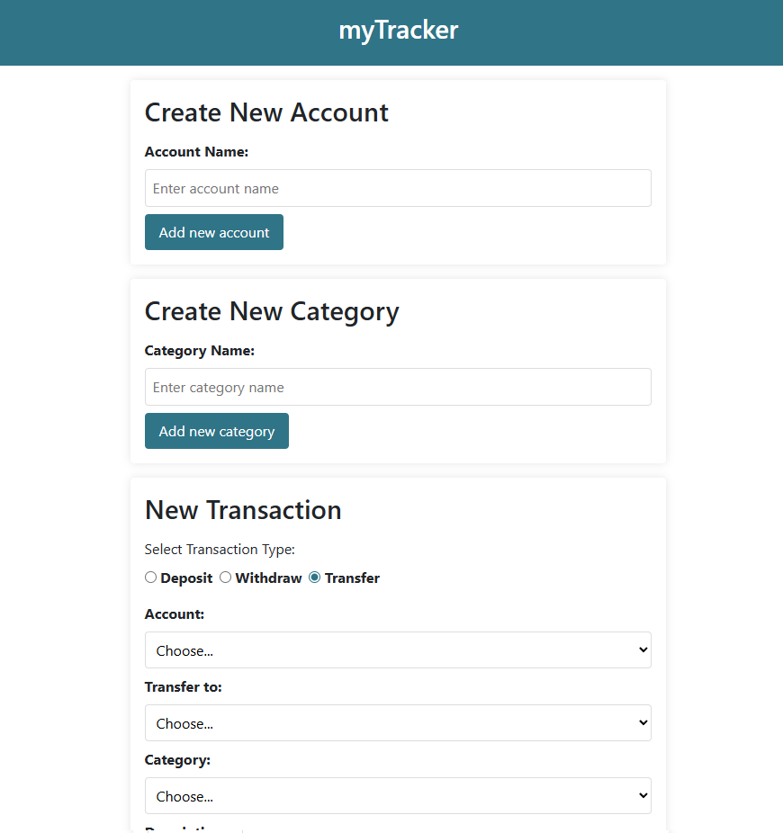
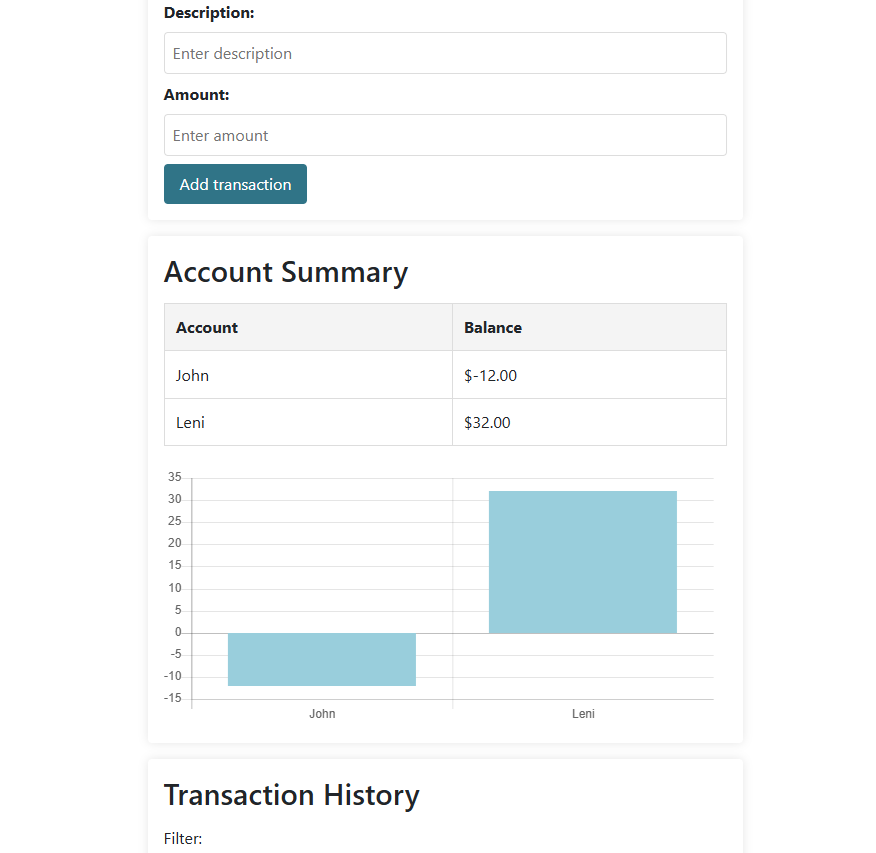
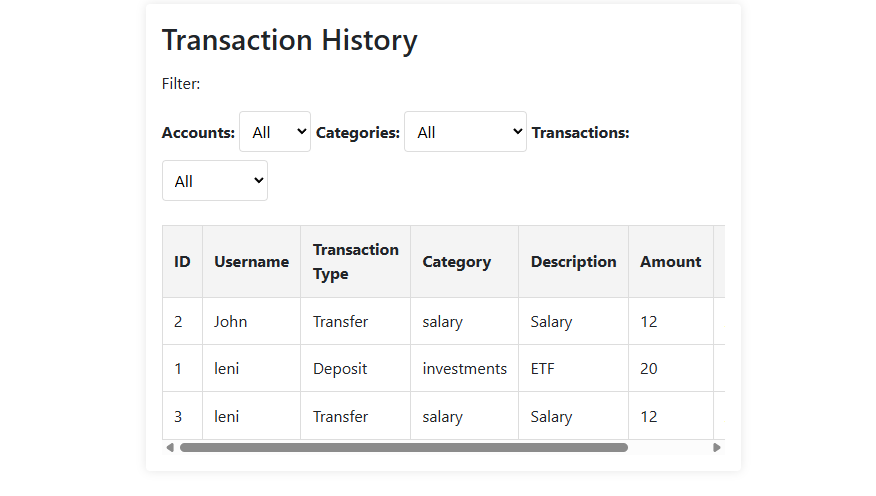

> **Note:** This repository is a personal backup of coursework originally developed as part of my studies at Cornerstone College. It was cloned from a institutional and private repository to preserve my contributions and development history.

# 💰 MyTrack – Personal Account & Transaction Tracker

> A single-page application for managing personal finances by manually tracking accounts and transactions.

---

## 📖 Overview

**MyTrack** allows users to create multiple accounts and manually record transactions such as **deposits**, **withdrawals**, and **transfers**. All data is stored persistently on the backend server.

- 🔄 Create accounts and categories  
- 💸 Add transactions and view summaries  
- 📊 View all transactions with optional filters  
- 🧾 All data persists via a RESTful Express server

---
📸 Screenshots
> Below are screenshots of the MyTrack app.






---

## 🛠 Tech Stack

### 🖥️ Frontend

- HTML, Sass, JavaScript
- jQuery
- Live Server, Concurrently

### 🔙 Backend

- Node.js, Express
- CORS
- JSON-based data handling

---

## 🚀 Getting Started

### Backend Setup

```bash
cd backend
npm install
npm run dev
```

Runs on: `http://localhost:3000`

### Frontend Setup

```bash
cd frontend
npm install
npm run dev
```

Launches Live Server and Sass in watch mode.

---

## ✅ Project Features

- Create and manage **accounts**
- Add, edit, and filter **transactions**
- Define custom **categories**
- Notification when new entries are added

---

## 📎 Notes

- All data is **manually entered**
- The focus was on **collaboration, OOP principles, and frontend logic**

---

## 🪪 License

This project is for academic and demonstrative purposes only.